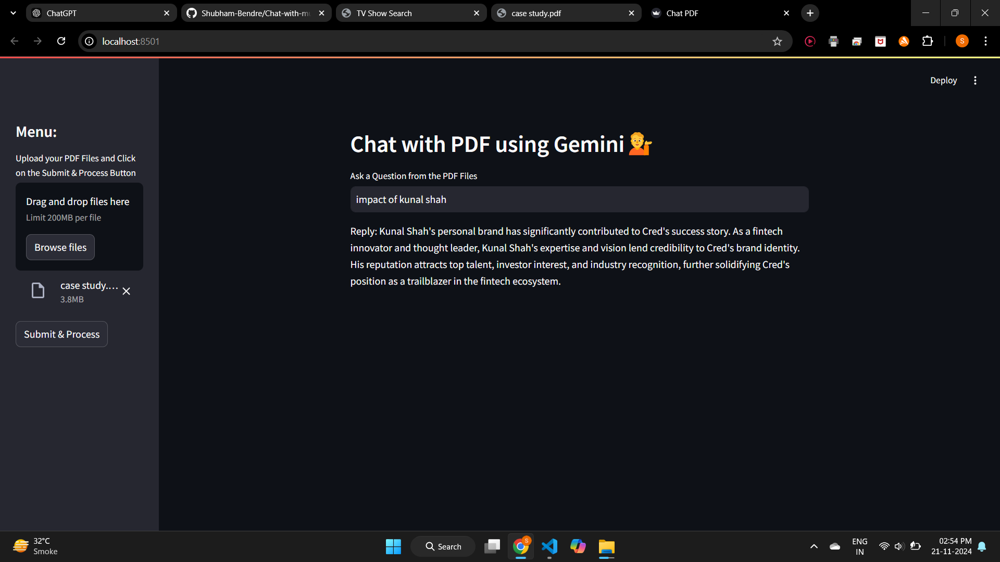

# 📚 Chat with PDF using Gemini 💁

Effortlessly interact with your PDF files using the power of **Google Generative AI**! This app enables users to upload PDF files, process them into a searchable format, and ask detailed questions based on the PDF content.

---

## 🚀 Features

- 📄 **Upload Multiple PDFs**: Seamlessly process one or more PDF files.
- 🧠 **AI-Powered QA**: Get answers to your questions based on the PDF content using **Gemini Pro**.
- 🗂️ **FAISS Indexing**: Efficient text chunking and embedding storage for rapid responses.
- 🔐 **Secure Access**: Integrated with environment variables for secure API key handling.

---

## 📂 File Structure

- `main.py`: Core Streamlit app logic.
- `requirements.txt`: All dependencies required for the project.
- `.env`: Stores your `GOOGLE_API_KEY` for secure API access.
- `faiss_index/`: Directory where FAISS indexing data is stored locally.

---

## 🤝 How It Works

1. **Upload PDFs**: Drag and drop your PDF files in the sidebar.
2. **Process PDFs**: Click on **Submit & Process** to extract text and create searchable embeddings.
3. **Ask Questions**: Enter your query in the input box and get detailed responses powered by Gemini AI.

---

## 🧩 Key Technologies

- **Streamlit**: Interactive and user-friendly web interface.
- **PyPDF2**: Extracts text from PDF documents.
- **LangChain**: Manages conversational chains and embeddings.
- **Google Generative AI**: Provides embeddings and conversational capabilities.
- **FAISS**: Fast and efficient similarity search.

---

## 💡 Usage Tips

- For best results, ensure your PDF documents contain searchable text (scanned images may not work well).
- Questions unrelated to the PDF context will result in: _"Answer is not available in the context."_.

---

## 📸 Screenshots

### 1️⃣ Main Task Window


## 🚀 Usage

To run the **app.py**,  execute the following command in your terminal:

```bash
streamlit run app.py
```

---
Feel free to 🌟 star this repo if you find it helpful! 🚀
